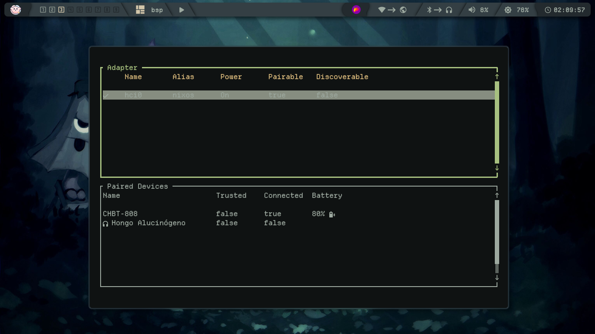
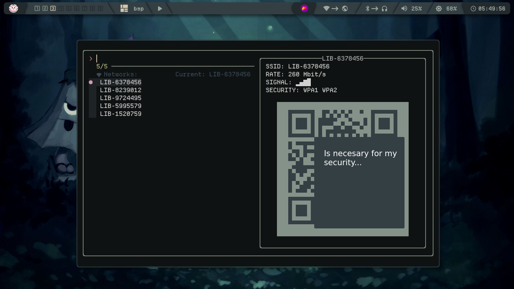
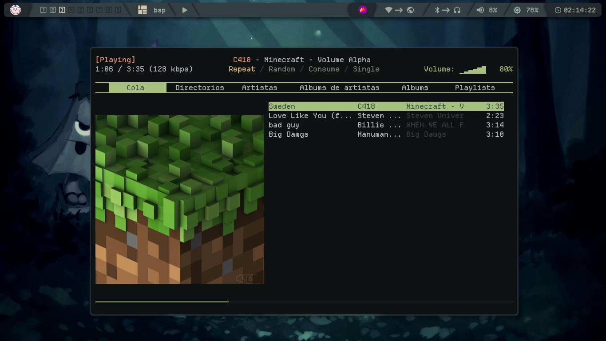
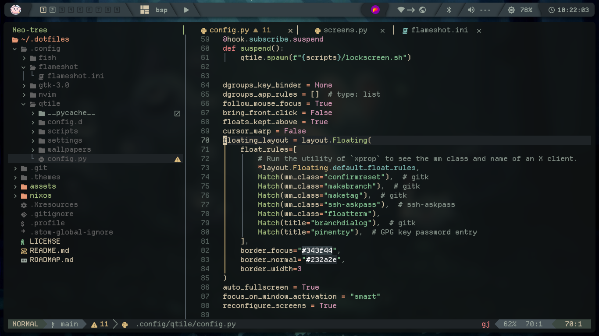
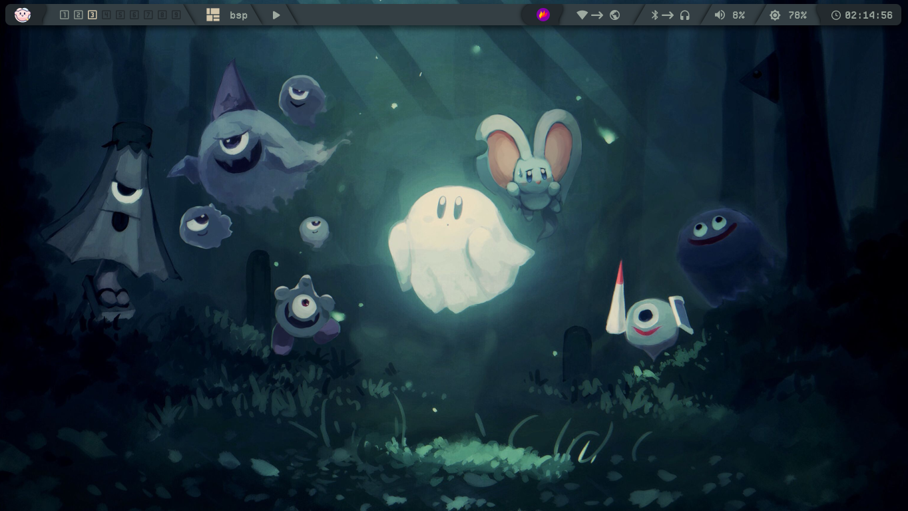

# My Greens Dotfiles 🌿

## Features 🦝
> [!NOTE]
> It's not finished yet, I still have things to add, but I have to start studying soon and I wanted to publish it before.

**Bluetooth tui:**
<sup>
  You con connect to bluetooth using bluetui.
</sup>


**Custom wifi tui:**
<sup>
  You can connect to wifi from a terminal tui made by me, can modify it to your liking.
</sup>


**Themed mpd client:**
<sup>
  I decide use rmpc as mpd client and fits the theme of the system.
</sup>


**Themed neovim:**
<sup>
  I make a fork of [neanias](https://github.com/neanias/everforest-nvim) and I make transparent background.
</sup>



**Cutest experience:**
<sup>
  The animation and the wallpapers are the most cozy and soft.
</sup>


## Installation

### 1: Add this to your `configuration.nix`
> [!NOTE]
> Btw you can find all my config in [nixos/configuration.nix](nixos/configuration.nix)

**Qtile**
``` nix
  services.xserver.windowManager.qtile.true;
```

**Software**
``` nix
  environment.systemPackages = with pkgs; [
    # Networking
    bluez
    bluez-alsa
    bluez-tools
    bluetui
    # Sound
    playerctl
    pulsemixer
    pamixer
    # Brightness
    brightnessctl
    # LockScreen
    i3lock-color
    imagemagick
    maim
    # Music
    mpd
    mpc
    mpv
    rmpc
    alsa-utils
    # Menu
    rofi
    fzf
    # Icons
    papirus-icon-theme
    bibata-cursors
    # Terminal
    kitty
    # Editor
    neovim
    # Notification
    dunst
    # Compositor
    picom-pijulius
    # Widgets
    eww
    # Python
    python3Full
    python3Packages.qrcode
    # X11
    xclip
    xdg-utils
    # Screenshot
    satty
    xdotool
    xorg.xdpyinfo
    # Yazelix
    zellij
    helix
    nushell
    yazi
    # Misc
    git
    stow
    ffmpeg
  ];
```
**Enable fish**
``` nix
  programs.fish.enable = true;
  users.defaultUserShell = pkgs.fish;
```
**Fonts**
``` nix
  fonts = {
    enableDefaultPackages = true;
    packages = with pkgs; [
      noto-fonts
      noto-fonts-extra
      noto-fonts-emoji
      open-sans
      source-han-mono
      departure-mono
      (nerdfonts.override { fonts = [ "NerdFontsSymbolsOnly" ]; })
    ];
  };
```
**Enable automount disks**
``` nix
  services.devmon.enable = true;
  services.gvfs.enable = true;
  services.udisks2.enable = true;
```
**Some games needed this libs (optional)**
``` nix
  programs.nix-ld.enable = true;
  programs.nix-ld.libraries = with pkgs; [
    xorg.libX11
    xorg.libXext
    xorg.libXinerama
    xorg.libXrandr
    xorg.libXcursor
    xorg.libXrender
    alsa-lib
    libpulseaudio
    libGL
    SDL2
    libxkbcommon
    xorg.libXi
  ];
```
**Finally, rebuild the system**
``` bash
sudo nixos-rebuild switch
```

### 2: **Clone the repo**
``` bash
git clone https://github.com/wux4an/.dotfiles
```

### 3: **Move or Remove your .files**
``` bash
# Move
mv ~/.config/qtile ~/.config/qtile-bk
mv ~/.config/gtk-3.0 ~/.config/gtk-3.0-bk
mv ~/.config/flameshot ~/.config/flameshot-bk
mv ~/.themes ~/.themes-bk
mv ~/.Xresources ~/.Xresources-bk
mv ~/.profile ~/.profile-bk
mv ~/.config/fish ~/.config/fish-bk
mv ~/.config/nvim ~/.config/nvim-bk
# Remove
rm -rf ~/.config/qtile
rm -rf ~/.config/gtk-3.0
rm -rf ~/.config/flameshot
rm -rf ~/.themes
rm -rf ~/.Xresources
rm -rf ~/.profile
rm -rf ~/.config/fish
rm -rf ~/.config/nvim
```

### 4: Link the files inside the .dotfiles directory
``` bash
cd ~/.dotfiles
nix-shell -p stow --run "stow ."
```
### 5: install fish plugins
``` bash
fish -c "curl -sL https://raw.githubusercontent.com/jorgebucaran/fisher/main/functions/fisher.fish | source && fisher update"
# My tide fish config:
tide configure --auto --style=Lean --prompt_colors='16 colors' --show_time=No --lean_prompt_height='One line' --prompt_spacing=Compact --icons='Many icons' --transient=Yes
```

> [!NOTE]
> You can view the [ROADMAP](ROADMAP.md).

## Credits:
+ [Darkkal44](https://github.com/Darkkal44/Cozytile) -> Cozytile, inspired me a lot
+ [gh0stzk](https://github.com/gh0stzk/dotfiles/tree/master/config/bspwm/src/config) -> picom config
+ [gh0stzk](https://github.com/gh0stzk/dotfiles/blob/master/config/bspwm/src/ScreenLocker) -> lockscreen
+ [luccahuguet](https://github.com/luccahuguet/yazelix) -> yazelix
